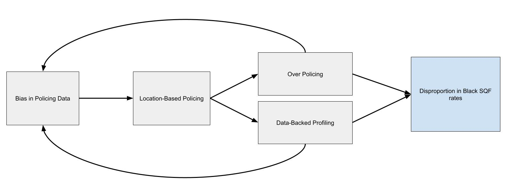
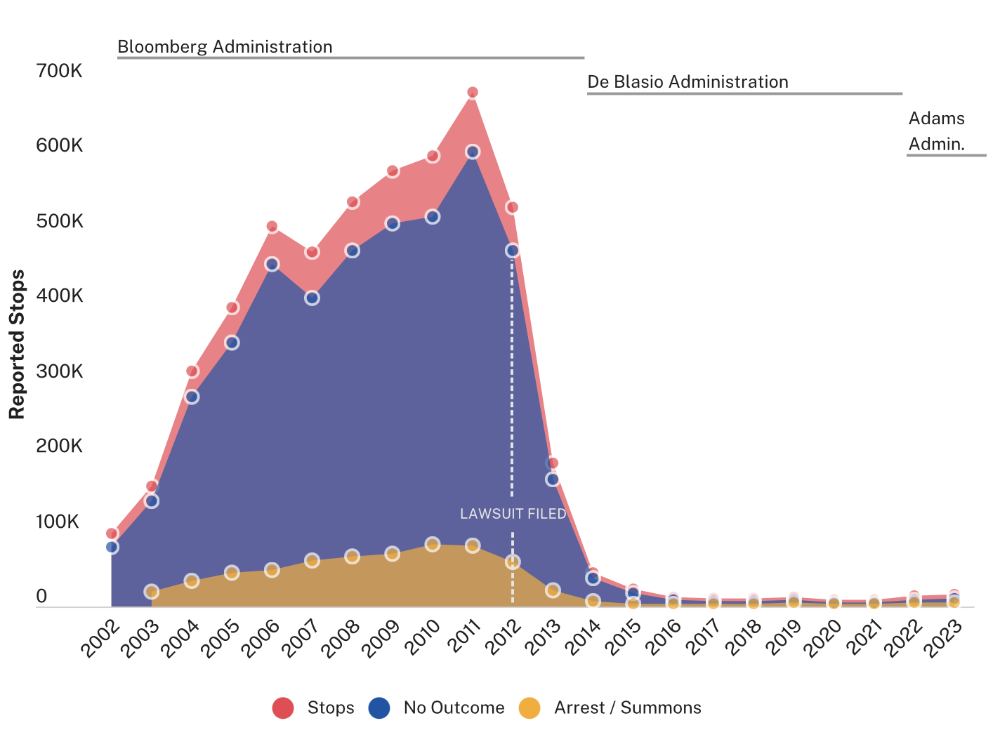
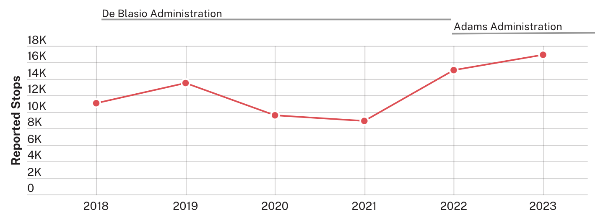

# Thesis Statement (IV, DV, Mechanism)
This thesis is motivated by the prevalent development of surveillance technology and predictive policing in the 21st century. The premise of this study is the suggestion that the implementation of predictive place-based policing has had a disparate racial impact in New York City.  In contrast to the existing literature, this research focuses on how place-based policing interacts with other forms, especially Stop-Question-Frisk (SQF) or the Terry Stop. The study seeks particularly to analyze why the proportion of Black individuals that are Terry stopped in New York City has increased since 2012.  I hypothesize that **data-driven hot-spot policing leads to a disproportionate amount of racialized non-arrest interactions by predisposing officers to the belief that individuals within these crime hotspots are more likely to commit crimes.**

# Approach and Data Sources
There were 5,249,105 NYPD stops recorded between 2002 and 2023. Of those stopped, 2,675,183 (51%) were Black, 1,569,780 (30%) were Hispanic, and 508,922 (10%) were White. This is despite New York’s overall population being 20.2% Black, 28.7% Hispanic, and 30.9% White as of the 2010 census. 

While it’s been found that when adjusted for the higher overall crime rate, arrest rates are not higher at hot spots [1], only 6% of all reported stops result in an arrest [2]. It has long been conjectured that the Terry stop was racially biased [3] and its use in NYC was ruled unconstitutional [3], but even as the total number of Terry stops has decreased (down from 685,724 in 2010 to 16,971 in 2023), the proportion of Black individuals stopped has consistently remained between 52% and 60% since its implementation in 2002, and the proportion growing post-Floyd vs. NYC. 

## Stop-and-Frisk Over Time

## Reported Stops (2018-2023)

Research has found that in 40% to 45% of violent crime hot spots in NYC, officers were conducting a significantly higher number of Terry stops than expected [1]. Previous research discusses how policing strategies can lead to racial disparities [4], [5], [6] and the civil rights implications of predictive policing [6], [7], but there is little in-depth quantitative analysis of racial variations in SQFs.

Two major events preceded the proportional increase in Black Terry stops over the last 10 years; Floyd vs. City of New York, which led to a dramatic decrease in the number of SQFs in NYC [3], and the NYPD’s implementation of the Domain Awareness System (DAS), which provides officers real-time crime statistics, biographical data, place-based critical alerts and potential threats, historical crime data, and other information. However, several problems arise with this big-data policing. 

1.	**Audits of the NYPD arrest system demonstrated recurring errors in crime data entry.** [8] 
  1. Officers fill out SQF forms by hand, and then the forms are entered manually into a database. Thus, the reliability of SQF data is an issue, and it should be considered while interpreting the results of this study. [1]
2.	Since 2016, NYPD’s DAS has employed an **AI-driven crime prediction tool**, Patternizr [9], **has raised concerns about racial bias** [10] 
  1. Especially because Patternizr includes arrest data in its predictions and research has posited that “predictive systems based primarily on arrests will mirror policing patterns more than predictive systems focused on reported crimes will.” [4]
3.	**Researchers observed that patrol officers become more like detectives trying to figure out the crime drivers in the predicted crime area.** [11] 
  1. Patrol officers got out of their cars more, engaged citizens more, and focused on “intelligence gathering.” Police officers stopped and questioned more people, ran people’s records, investigated unreported narcotics use, and tried to understand who was involved in criminal activity. [4] 

**Given that we care about mitigating the disparate impact-cost of public safety, it is important that we understand how the spillover effects of the development and implementation of these technologies.**

## Assumptions
Since hot-spot policing is implemented as a resource distribution method, it concentrates officers in predictably “high-crime” areas. While it has been found that there is a high correlation between the concentration of crimes and SQFs, hot-spot policing is a theoretically precise deployment method (with officers being deployed to specific street intersections). The designation of an area as high-crime, therefore, leads to over-policing in the form of resource concentration and data-backed profiling given that officers have statistical insight that crimes often occur within this small geographic area.

# Methods
For my thesis, I plan on using a nested research design that combines large-scale statistical and geospatial analysis with two comparative case studies. This approach will hopefully allow me to test my research question, how and why predictive policing technologies shape racial disparities in Terry stops, particularly for Black individuals. I hope this enhances both the internal and external validity of my findings and enables a deeper understanding of my proposed causal mechanisms.

First, I will analyze 10 years of publicly available NYPD stop-and-frisk data (2010-2020), cross-referenced with precinct-level crime data, census-tract-level demographic information, and operational policing data such as patrol frequency, arrest rates, and the rollout of predictive tools like the Domain Awareness System (DAS) [12], [13] and Patternizr [10], [14] in New York City. This statistical and geospatial analysis will allow me to test my central hypothesis: that the use of predictive, place-based policing technologies (IV) correlates with an increase in the racial disparity of Terry stops, particularly against Black individuals (DV), even when controlling for local crime rates and neighborhood composition.

## Data Sources
1. [Stop-and-frisk (SQF) data from NYPD](https://www.nyc.gov/site/nypd/stats/reports-analysis/stopfrisk.page), 2010-2020. 
2. [CompStat 2.0 crime data from NYPD](https://compstat.nypdonline.org), 2010-2020
3. [Census data (demographics etc.) from the American Community Survey (ACS)](https://www.census.gov/programs-surveys/acs/data.html), 2010-2020
4. Survey of Officer Behavior Random Selection of Hotspots
5. Interviews with New York Police Officers

## Mechanism Criteria
To further refine these findings and explore underlying mechanisms, I will conduct comparative case studies of several dozen crime “hotspots” across precincts in New York City and do the same in another city that uses hot-spot policing like Los Angeles. These hotspots will be selected based on three dimensions:
1.  The degree of predictive policing implementation (e.g., the extent of DAS/Patternizr usage);
2.  The racial and socioeconomic composition of the neighborhood; and
3.  Observed temporal changes in stop-and-frisk trends, particularly post-2013 following Floyd v. City of New York.

This criteria will help me select both typical cases (where predictive policing is strongly associated with racial disparities) and deviant cases (where disparities exist without heavy tech use, or where predictive tools are used without resulting in racial disparities). By exploring a diverse set of cases, I can explore where the relationship between predictive policing and race holds, thus identifying scope conditions and possible moderating variables such as officer discretion, leadership practices, or community oversight.

My approach draws inspiration from the RAND Predictive Policing Shreveport Study [11], which assessed predictive policing by comparing areas with and without the intervention while using quasi-experimental logic. Like Hunt et al. in the RAND study, I will analyze police behavior and stop outcomes in both predictive and non-predictive areas. Though I cannot implement a randomized control trial, I do take advantage of as-if random variation in the adoption and intensity of predictive policing tools across NYPD precincts. Decisions about where and when to implement technologies like DAS and Patternizr have been driven largely by internal department logistics and not by neighborhood racial composition alone. This allows me to treat the variation in predictive policing implementation across otherwise similar precincts as a form of natural experiment.

For example, I will compare stop-and-frisk patterns in two precincts with similar crime rates and racial demographics, but different levels of DAS use. If the precinct with greater predictive policing shows a significantly higher racial disparity in stops (particularly non-arrest stops), this supports my hypothesis that the technology itself, not just underlying crime or officer discretion, is amplifying racial bias. Similarly, by comparing changes over time in predictive policing “hotspots,” I can explore whether officers in those zones engage more frequently in discretionary surveillance behaviors (like intelligence gathering or “proactive” stopping) than officers in non-hotspot areas.

## Internal Case Selection
I will use a diverse case strategy to supplement my data. Rather than selecting only extreme or average cases, I will choose precincts and hotspots that vary systematically along the independent variable (degree of predictive policing) and the dependent variable (racial disparity in stops). This will allow me to identify where the predictive policing–racial disparity link is strong, where it is weak, and what contextual factors explain the difference. Such a design is essential to rule out rival explanations like disparities being the result of individual officer bias or the racial geography of crime. By comparing precincts that are demographically similar but differ in their use of predictive tools, or precincts with the same tech level but different stop patterns, I can better isolate the causal role of technology.

## External Case Selection
While I will begin with New York City, I plan to add a second city for comparison. This will further enhance the external validity of my study by testing whether the mechanisms observed in NYC travel to other urban contexts. The second city will be chosen based on the following criteria: 
1.	Use of predictive policing tools;
2.	Availability of stop or arrest data, ideally disaggregated by race; 
3.	A racially diverse population; and 
4.	Some public visibility or oversight of its policing technologies. 
Potential cities I’ve looked at are Chicago, which has used HunchLab and other predictive tools, Los Angeles, which implemented person-based predictive policing through LASER (now discontinued), or Baltimore, which has integrated predictive tools into its CompStat process. This second site will enable both between-city comparisons and additional within-city analysis of precincts or neighborhoods.

The universe of cases my study seeks to explain includes U.S. urban police departments that use place-based predictive policing tools. While data limitations restrict me to a few cities in practice, I aim to develop theory and findings that are applicable across a broader set of technologically mediated law enforcement agencies. New York is a particularly compelling case because of its long history of stop-and-frisk, its early adoption of predictive policing tools, and its rich, publicly available policing and demographic datasets. The addition of a second city will test the generalizability of my claims and clarify which dynamics are unique to NYPD versus common across predictive policing systems.

# Next Steps
- **Find a Thesis Advisor**. I have a few leads, but I still need to find someone who is willing to work with me on this project.
- **Confirm Second Case City**. I need to find another city that has comprable data availability and richness.
- **Finalize method for geospatial sectioning**. There are conflicting methodologies for delineating space for analysis. Whether intersections [1], [12] or spatial tiles [13], [14]. 
- **Draft IRB Proposal**. I know the IRB rep said we probably wouldn't need Approval but I still need to draft an IRB proposal for the interviews with NYPD officers.
- **Preliminary Descriptive Analysis**

# Works Cited 
- [1]	H. Duru and H. Akbas, “Measuring hot spots policing in non-research settings,” International Journal of Law, Crime and Justice, vol. 65, p. 100468, Jun. 2021, doi: 10.1016/j.ijlcj.2021.100468.
- [2]	“A Closer Look at Stop-and-Frisk in NYC,” NYCLU. Accessed: Feb. 03, 2025. [Online]. Available: 
- [3]	Center for Constitutional Rights, “Floyd, et al. v. City of New York, et al.,” Center for Constitutional Rights, New York, NY, Feb. 2025. Accessed: Feb. 10, 2025. [Online]. Available: 
- [4]	A. G. Ferguson, The rise of big data policing: surveillance, race, and the future of law enforcement. New York: New York University Press, 2017.
- [5]	K. Lum and W. Isaac, “To Predict and Serve?,” Significance, vol. 13, no. 5, pp. 14–19, Oct. 2016, doi: 10.1111/j.1740-9713.2016.00960.x.
- [6]	Barocas, Solon; Selbst, Andrew D, “Big Data’s Disparate Impact,” California Law Review, vol. 104, no. 3, pp. 671–732, 2016, doi: 10.15779/Z38BG31.
- [7]	R. Richardson, J. Schultz, and K. Crawford, “Dirty Data, Bad Predictions: How Civil Rights Violations Impact Police Data, Predictive Policing Systems, and Justice,” Feb. 13, 2019, Rochester, NY: 3333423. Accessed: Feb. 25, 2025. [Online]. Available: 
- [8]	J. Morganteen, “Report Confirms NYPD Crime Stats Manipulation,” The New York World, Jul. 12, 2013. Accessed: Mar. 27, 2025. [Online]. Available: 
- [9]	A. Chohlas-Wood and E. S. Levine, “A Recommendation Engine to Aid in Identifying Crime Patterns,” INFORMS Journal on Applied Analytics, vol. 49, no. 2, pp. 154–166, Mar. 2019, doi: 10.1287/inte.2019.0985.
- [10]	B. Holak, “NYPD’s Patternizr crime analysis tool raises AI bias concerns | TechTarget,” TechTarget. Accessed: Mar. 27, 2025. [Online]. Available: 
- [11]	P. Hunt, J. Saunders, and J. S. Hollywood, “Evaluation of the Shreveport Predictive Policing Experiment,” RAND Corporation, Jul. 2014. Accessed: Mar. 27, 2025. [Online]. Available: 
- [12]	E. S. Levine, J. Tisch, A. Tasso, and M. Joy, “The New York City Police Department’s Domain Awareness System,” Interfaces, vol. 47, no. 1, pp. 70–84, Feb. 2017, doi: 10.1287/inte.2016.0860.
- [13]	New York Police Department, “Domain Awareness System (DAS): Impact and Use Policy,” New York Police Department, New York, N.Y., Apr. 2021. Accessed: Mar. 25, 2025. [Online]. Available: 
- [14]	M. Griffard, “A Bias-Free Predictive Policing Tool?: An Evaluation of the NYPD’s Patternizr,” Fordham Urban Law Journal, vol. 43, no. 1, pp. 43–70, 2019.

